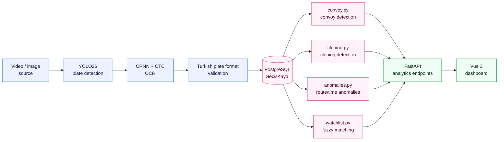

# AGIS: Vehicle Transit Intelligence System

An end-to-end system that detects and reads license plates from camera
footage into structured transit records, analyzes those records over a
relationship graph to surface patterns like convoys, plate cloning, and
route/time anomalies, and presents the results in a web dashboard.

## Architecture



## Features

- Plate detection: YOLO26 fine-tune
- Plate OCR: CRNN + CTC
- Track-level character voting
- End-to-end detection + OCR pipeline (`vision/pipeline.py`)
- Synthetic scenario generator with planted events (`synth_scenario.py`)
- Fuzzy watchlist matching
- Convoy detection: relationship graph normalized by traffic volume
- Plate cloning detection: physically impossible travel speed
- Route/time anomaly detection
- FastAPI analytics service and Vue 3 dashboard

## Dashboard

> **Note:** The project itself (dashboard UI, domain terms, code, and the
> other docs in this repo) is in Turkish, matching the deployment context.
> This README is translated to English for accessibility.


`dashboard/` is a Vue 3 + Vite panel with one tab per analytics endpoint
(`/konvoylar`, `/klonlar`, `/anomaliler`, `/aranan/eslesmeler`), each
fetching live data. No router, state library, or UI/chart library.
Tab switching is a plain `ref`, and charts are hand-written CSS/SVG.

The easiest way to run it: `docker compose up --build` already starts
`dashboard` too, at http://localhost:5173. To run it separately:

```bash
# API (in a separate terminal)
python3 -m venv .venv-api && source .venv-api/bin/activate
pip install -r requirements-api.txt
uvicorn app.main:app --reload

# Dashboard
cd dashboard
npm install
npm run dev          # http://localhost:5173
```

The page looks fairly empty with a single scenario; for a richer demo
dataset see the multi-seed loading recipe in `dashboard/README.md`.

## Results

| Component | Metric | Result |
|---|---|---|
| Plate detection | mAP50 / mAP50-95 | 0.993 / 0.882 |
| Plate OCR (realistic degradation) | Exact-match | 90–96% |
| Plate OCR (real photo, n=20) | Exact-match | 25% |
| Character voting | Gain over single-frame | +12 to +44 points |
| Watchlist matching (fuzzy) | Recall gain | 50%→90% (severity 0.6) |
| Convoy detection | False positives | 0 / 7 seeds |
| Plate cloning detection | False positives | 0 / 7 seeds |
| Route/time anomaly detection | Catch rate / false positives | 15/16, 0 (8 seeds) |

## Setup

### 1. Bring up the services

```bash
docker compose up --build
```

Check: http://localhost:8000/health, http://localhost:8000/docs, and
http://localhost:5173 (dashboard)

### 2. Local environment for the model side

The Docker image only carries the API; model training happens locally.

```bash
python3 -m venv .venv && source .venv/bin/activate
pip install -r requirements-ml.txt
```

## Usage

### Generate synthetic plate data

```bash
# Visual sanity check first: 50 clean, undegraded plates
python3 tools/synth_plates.py --count 50 --out data/preview --clean --width 520 --height 110

# Training set
python3 tools/synth_plates.py --count 20000 --out data/synth_plates
```

`data/synth_plates/labels.txt` contains labels in
`file_path<TAB>plate_text` format.

### Train the plate detection model

Download a plate dataset in YOLOv8 format from Roboflow Universe (e.g.
`plakatanima-vnt3k/turkish-number-plates`), extract it under
`data/plates/`, then:

```bash
python3 -m vision.train_detector --data data/plates/data.yaml --epochs 30
```

### Generate and evaluate an analytics scenario

A synthetic scenario with planted events (convoy, routine co-travel,
cloned plate, route/time anomaly), with every reading passed through the
actual OCR checkpoint:

```bash
python3 synth_scenario.py --out data/scenario

python3 -m analytics.eval_watchlist --scenario data/scenario
python3 -m analytics.eval_convoy --scenario data/scenario
python3 -m analytics.eval_cloning --scenario data/scenario
python3 -m analytics.eval_anomalies --scenario data/scenario
```

Each `eval_*.py` measures its own module against the planted events in
the scenario's `ground_truth.json` and prints a precision/recall number.

## Project structure

```
platetrace/
├── docker-compose.yml       # PostgreSQL + API + Dashboard
├── Dockerfile                # API image (dashboard/Dockerfile is its own image)
├── requirements-api.txt     # Dependencies that go into Docker (API + analytics/)
├── requirements-ml.txt      # Local model environment (vision/ + scenario generator)
├── requirements-test.txt    # pytest + httpx (API tests)
├── app/                      # FastAPI service
│   ├── main.py              # Endpoints (transit records + 4 analytics endpoints calling analytics/)
│   ├── db.py                # Database connection
│   └── models.py            # Schema: GecisKaydi, Nokta, ArananArac
├── vision/                   # Detection layer, needs torch/ultralytics, never ships in the API image
│   ├── train_detector.py    # YOLO fine-tune (plate detection)
│   ├── train_ocr.py         # CRNN+CTC training (plate OCR)
│   ├── eval_ocr.py          # OCR degradation curve
│   ├── voting.py            # Track-level character voting
│   ├── eval_voting.py       # Voting vs. single-frame OCR comparison
│   └── pipeline.py          # Detection+OCR -> GecisKaydi
├── analytics/                 # Analytics layer, the only repo code that ships in the API image
│   ├── watchlist.py          # Fuzzy watchlist matching
│   ├── convoy.py             # Convoy detection
│   ├── cloning.py            # Plate cloning detection
│   ├── anomalies.py          # Route/time anomaly detection
│   └── eval_watchlist.py, eval_convoy.py, eval_cloning.py, eval_anomalies.py
│                              # Measures each module against ground truth
├── tests/
│   └── test_api.py          # API tests (pytest, in-memory SQLite)
├── dashboard/                # Vue 3 + Vite frontend (4 analytics views)
├── tools/
│   └── synth_plates.py      # Synthetic plate generator
└── synth_scenario.py         # Planted-event scenario generator (bridges vision/ and analytics/)
```

Scripts under `vision/` and `analytics/` run as packages
(`python3 -m vision.pipeline`, `python3 -m analytics.eval_convoy`, etc.),
since modules import each other with absolute paths like
`analytics.convoy`, so they can't be run as a bare file path
(`python3 analytics/eval_convoy.py`).

## Data and privacy

No real plate or camera data is used. Plates are personal data under
KVKK (Turkey's GDPR equivalent). The detection model is trained on public
datasets; the OCR model is trained on synthetic data generated in this
repo.
