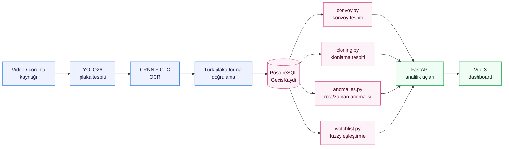
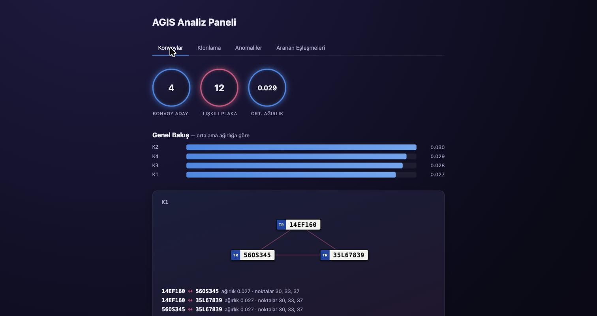

# AGIS: Araç Geçiş İstihbarat Sistemi

Kamera görüntüsünden araç ve plaka tespiti yaparak yapılandırılmış geçiş
kayıtları üreten; bu kayıtları bir ilişki grafiği üzerinde analiz ederek
konvoy, plaka klonlama ve rota/zaman anomalisi gibi örüntüleri ortaya
çıkaran, sonuçları bir web panelinde sunan uçtan uca bir sistem.

## Mimari



## Özellikler

- Plaka tespiti — YOLO26 fine-tune
- Plaka OCR — CRNN + CTC
- Track-seviyesi karakter oylaması
- Uçtan uca tespit + OCR pipeline'ı (`pipeline.py`)
- Planted olaylı sentetik senaryo üreteci (`synth_scenario.py`)
- Bulanık (fuzzy) aranan araç eşleştirme
- Konvoy tespiti — trafik hacmine göre normalize edilmiş ilişki grafiği
- Plaka klonlama tespiti — fiziksel olarak imkânsız seyahat hızı
- Rota/zaman anomali tespiti
- FastAPI analitik servisi ve Vue 3 dashboard

## Dashboard



`dashboard/`, dört analitik ucun (`/konvoylar`, `/klonlar`, `/anomaliler`,
`/aranan/eslesmeler`) her biri için canlı veri çeken bir sekme olan bir
Vue 3 + Vite paneli. Router, state kütüphanesi, UI/chart kütüphanesi yok;
sekme geçişi düz bir `ref`, grafikler el yazımı CSS/SVG.

En basit yol — `docker compose up --build` zaten `dashboard`'ı da
başlatıyor: http://localhost:5173. Ayrı ayrı çalıştırmak için:

```bash
# API (ayrı bir terminalde)
python3 -m venv .venv-api && source .venv-api/bin/activate
pip install -r requirements-api.txt
uvicorn app.main:app --reload

# Dashboard
cd dashboard
npm install
npm run dev          # http://localhost:5173
```

Sayfa tek bir senaryoyla oldukça boş görünür; zengin bir demo veri seti
için `dashboard/README.md`'deki çoklu-tohum yükleme tarifine bakılabilir.

## Sonuçlar

| Bileşen | Metrik | Sonuç |
|---|---|---|
| Plaka tespiti | mAP50 / mAP50-95 | 0.993 / 0.882 |
| Plaka OCR (gerçekçi bozulma) | Exact-match | %90–96 |
| Plaka OCR (gerçek fotoğraf, n=20) | Exact-match | %25 |
| Karakter oylaması | Tek kareye göre kazanç | +12 ila +44 puan |
| Aranan araç eşleştirme (fuzzy) | Recall kazancı | %50→%90 (severity 0.6) |
| Konvoy tespiti | Yanlış pozitif | 0 / 7 tohum |
| Plaka klonlama tespiti | Yanlış pozitif | 0 / 7 tohum |
| Rota/zaman anomali tespiti | Yakalama / yanlış pozitif | 15/16, 0 (8 tohum) |

Her rakamın nasıl ölçüldüğü (script, metodoloji, örneklem büyüklüğü) için
[`PROJE_RAPORU.md`](PROJE_RAPORU.md).

## Kurulum

### 1. Servisleri ayağa kaldır

```bash
docker compose up --build
```

Kontrol: http://localhost:8000/health, http://localhost:8000/docs ve
http://localhost:5173 (dashboard)

### 2. Model tarafı için yerel ortam

Docker imajı sadece API'yi taşıyor; model eğitimi yerelde yapılır.

```bash
python3 -m venv .venv && source .venv/bin/activate
pip install -r requirements-ml.txt
```

## Kullanım

### Sentetik plaka verisi üret

```bash
# Önce görsel kontrol: 50 tane bozulmamış plaka
python3 tools/synth_plates.py --count 50 --out data/preview --clean --width 520 --height 110

# Eğitim seti
python3 tools/synth_plates.py --count 20000 --out data/synth_plates
```

`data/synth_plates/labels.txt` içinde `dosya_yolu<TAB>plaka_metni` formatında
etiketler bulunur.

### Plaka tespit modelini eğit

Roboflow Universe üzerinden YOLOv8 formatında bir plaka veri seti indir
(ör. `plakatanima-vnt3k/turkish-number-plates`), `data/plates/` altına
çıkar, sonra:

```bash
python3 train_detector.py --data data/plates/data.yaml --epochs 30
```

### Analitik senaryosu üret ve değerlendir

Planted olaylı (konvoy, rutin birlikte seyahat, klonlanmış plaka, rota/zaman
anomalisi) sentetik bir senaryo, gerçek OCR checkpoint'inden geçirilmiş
okumalarla:

```bash
python3 synth_scenario.py --out data/scenario

python3 eval_watchlist.py --scenario data/scenario
python3 eval_convoy.py --scenario data/scenario
python3 eval_cloning.py --scenario data/scenario
python3 eval_anomalies.py --scenario data/scenario
```

Her `eval_*.py`, kendi modülünü senaryonun `ground_truth.json` dosyasındaki
planted olaylara karşı ölçüp precision/recall rakamı basar.

## Proje yapısı

```
platetrace/
├── docker-compose.yml       # PostgreSQL + API + Dashboard
├── Dockerfile                # API imajı (dashboard/Dockerfile kendi imajı)
├── requirements-api.txt     # Docker içine giren bağımlılıklar
├── requirements-ml.txt      # Yerel model ortamı
├── requirements-test.txt    # pytest + httpx (API testleri)
├── app/
│   ├── main.py              # FastAPI uçları (geçiş kaydı + analitik)
│   ├── db.py                # Veritabanı bağlantısı
│   └── models.py            # Şema: GecisKaydi, Nokta, ArananArac
├── tests/
│   └── test_api.py          # API testleri (pytest, in-memory SQLite)
├── dashboard/                # Vue 3 + Vite arayüzü (4 analitik görünüm)
├── tools/
│   └── synth_plates.py      # Sentetik plaka üreteci
├── train_detector.py        # YOLO fine-tune (plaka tespiti)
├── train_ocr.py             # CRNN+CTC eğitimi (plaka OCR)
├── eval_ocr.py              # OCR degradasyon eğrisi
├── voting.py                # Track içi karakter oylaması
├── eval_voting.py           # Oylama vs. tek kare OCR karşılaştırması
├── pipeline.py              # Tespit+OCR -> GecisKaydi
├── synth_scenario.py        # Planted olaylı analitik senaryo üreteci
├── watchlist.py              # Bulanık aranan araç eşleştirme
├── convoy.py                 # Konvoy tespiti
├── cloning.py                # Plaka klonlama tespiti
├── anomalies.py              # Rota/zaman anomali tespiti
└── eval_watchlist.py, eval_convoy.py, eval_cloning.py, eval_anomalies.py
                              # Her analitik modül için ground-truth'a karşı ölçüm
```

## Veri ve gizlilik

Gerçek plaka ve kamera verisi kullanılmaz. Plaka, KVKK kapsamında kişisel
veri niteliğindedir. Tespit modeli açık veri setleriyle, OCR modeli bu
projede üretilen sentetik veriyle eğitilir.
